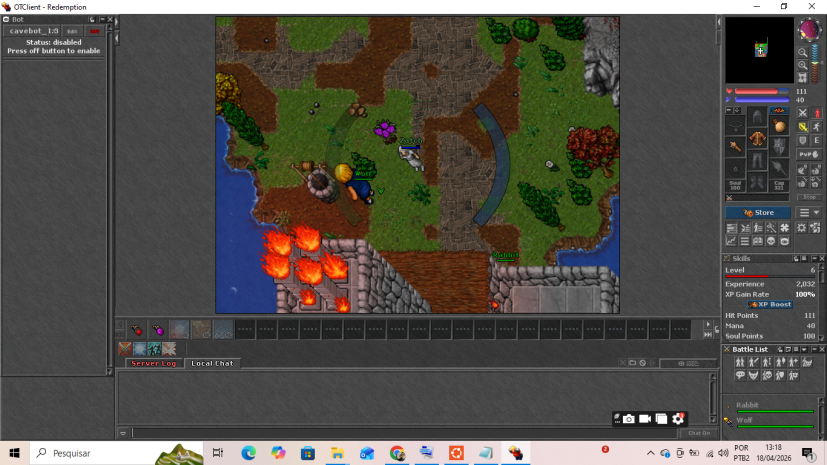
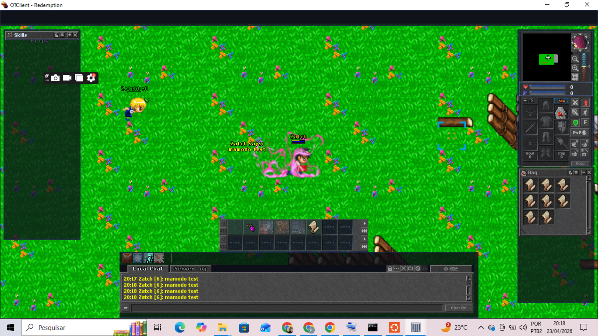

# OTServer Custom

Projeto pessoal baseado em um OTServer open source, com foco em customização de sistemas, modificação de engine em C++ e integração client-server.

---

## Fullscreen Gameplay (Engine + Client Modification)

Modificação no core do servidor e no client para aumentar a quantidade de tiles renderizados, permitindo uma visão ampliada do mapa (fullscreen gameplay).

---

## Demonstração

### Antes vs Depois

<p align="center">
  
  
</p>

---

## Impacto técnico

* Aumento do campo de visão do jogador
* Maior volume de dados enviados do servidor para o client
* Alterações em `map.h` e `const.h`
* Ajustes no client para suportar renderização ampliada

---

## Principais modificações

### Core (C++)

* Alterações em `src/monster.cpp` e `src/monster.h`
* Ajuste na lógica de foco dos monstros para priorizar summons
* Modificações no sistema de combate e seleção de target

### Scripts (Lua)

* Sistema inicial de controle de summon
* Scripts de movimentação e testes de efeitos
* Integração com eventos de login

### Client (OTClient)

As modificações do client estão em:

```
client_mods/
```

* Ajuste na renderização de tiles
* Alterações no volume de dados recebidos
* Base para controle de entidades via input

---

## Em desenvolvimento

Sistema avançado de summons:

* Relação entre jogador (owner) e summon
* Sistema de progressão
* Movimentação controlada pelo jogador
* Persistência em banco de dados
* Integração completa client-server

---

## Tecnologias

* C++
* Lua
* Git
* Arquitetura client-server
* Uso de IA como apoio para debugging e aprendizado

---

## Objetivo

Projeto focado em prática real de desenvolvimento, análise de código legado e implementação de novas mecânicas em um ambiente client-server.

---

## Contexto

Projeto utilizado como laboratório de estudo para entender funcionamento interno de servidores de jogo, comunicação com client e modificações em engine.
